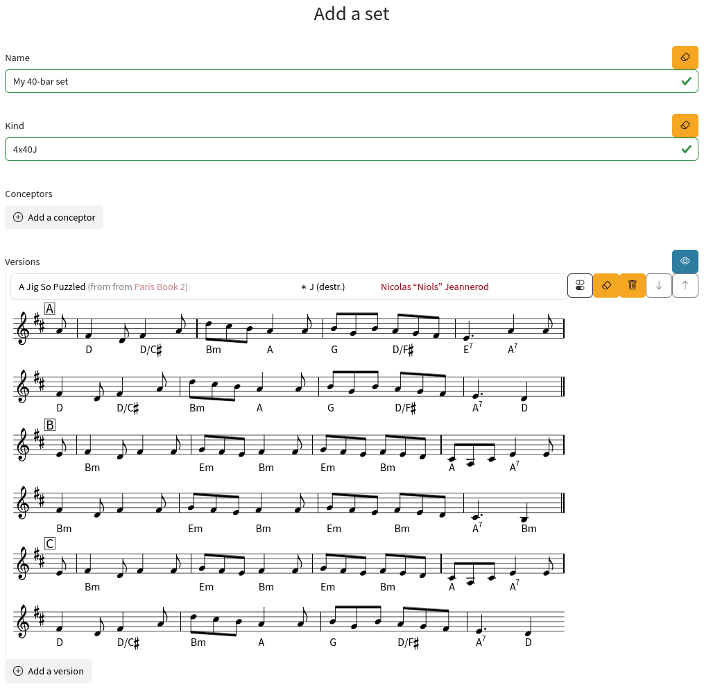
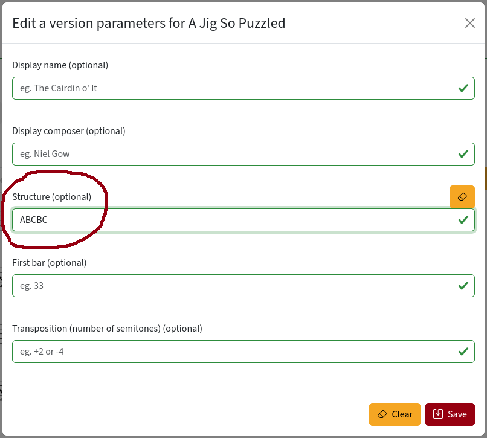

# Destructured versions

Destructured versions are entered into Dancelor part by part rather than as a
single block. This lets you choose how the version should be structured instead
of being locked into one format. These versions display with a default structure
when browsing, but you can customize the structure when creating a set.

Take [A Jig So Puzzled] as an example. At first glance, it looks like a regular
AABC version, but Dancelor notes it's a "destructured version in D, shown here
as AABC". In tables, where other versions show as "32 J (AABC)", this one shows
as "\* J (destr.)".

[A Jig So Puzzled]: https://dancelor.org/version/ncuw-1dym-fmfx

Both labels mean the same thing: Dancelor knows what parts A, B, and C are
individually and displays them as AABC by default because that's how the version
was entered (and, in this case, composed).

Now suppose you like this tune but need it for a 40-bar dance. Start making a
set and select your version:

Notice it shows as "destructured" with no bar numbers—just parts "A", "B", and
"C". That's because Dancelor doesn't yet know what structure you want. Click the
parameters button to customize this version. Let's say we want ABCBC:

Saving the parameters creates no visible change in the editor, but the structure
is saved. Save your set and view it:

Tada!

As of 24 November 2025, destructured versions are still new and some details
need refinement. For instance, they currently show as destructured when no
structure has been entered. This may change so they display a default structure
instead. Please report your experience to help improve Dancelor.
